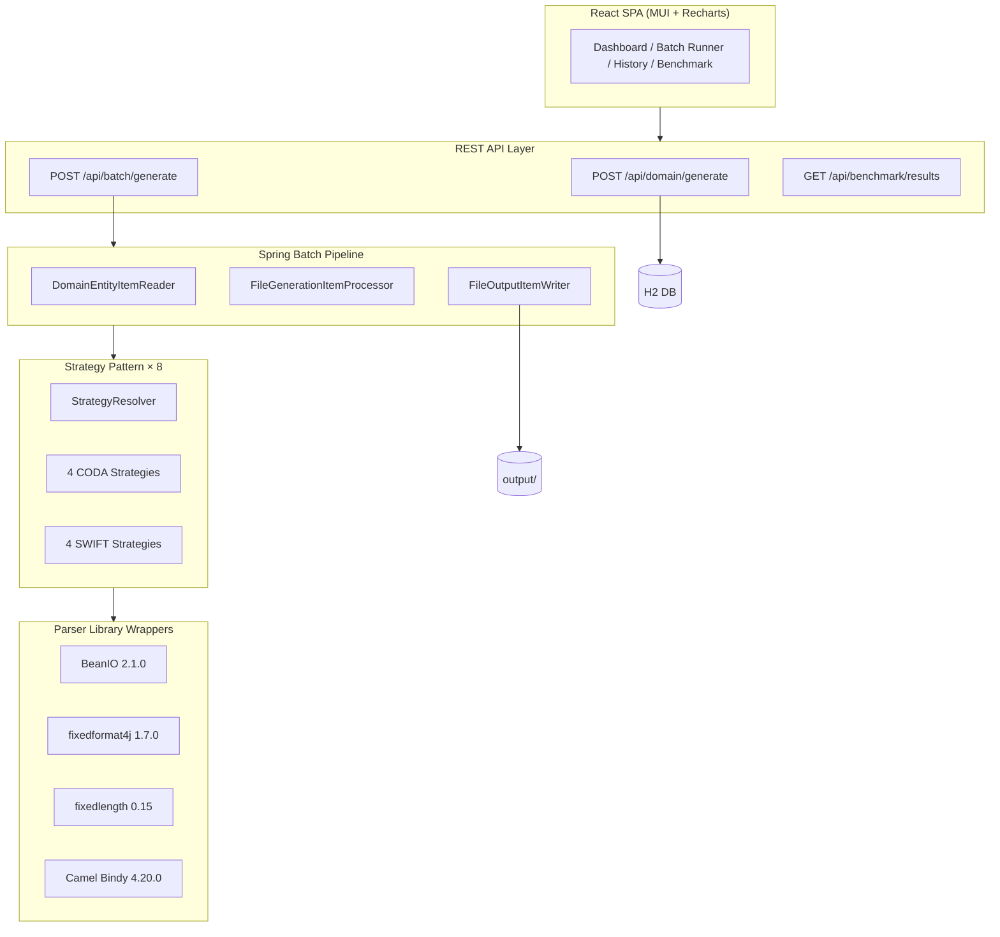

# Banking Fixed-Length File Generator & Parser Validation Platform

[](https://github.com/wallaceespindola/fixed-length-converters/actions/workflows/build.yml)
[](https://github.com/wallaceespindola/fixed-length-converters/actions/workflows/test.yml)
[](https://github.com/wallaceespindola/fixed-length-converters/actions/workflows/codeql.yml)
[](https://adoptium.net/)
[](https://spring.io/projects/spring-boot)
[](LICENSE)

Enterprise-grade banking file experimentation and benchmarking platform. Generates, parses, and benchmarks **CODA** and **SWIFT MT940** fixed-length banking files using **4 Java formatter libraries**, all orchestrated through **Spring Batch** and the **Strategy Pattern**.

---

## Overview

This platform is a technical laboratory for evaluating Java fixed-length parser frameworks across correctness, performance, and Spring Batch compatibility. Engineers can:

- Generate realistic banking transaction datasets (20 accounts, 200 transactions per call)
- Trigger Spring Batch jobs to produce CODA or SWIFT MT files via any of 4 libraries
- Compare library outputs side-by-side through benchmark dashboards
- Export benchmark results as CSV, JSON, or Markdown

---

## Architecture



### Batch Pipeline

```
ItemReader (H2) → ItemProcessor (StrategyResolver) → ItemWriter (output/)
```

Each Spring Batch job is parameterised by `fileType` (CODA/SWIFT) and `library` (BEANIO/FIXEDFORMAT4J/FIXEDLENGTH/BINDY). Jobs are **restartable** from the last checkpoint.

### Strategy Pattern

8 strategy implementations — one per `FileType × Library` combination — all behind a single `FileGenerationStrategy` interface:

| Class | Format | Library |
|---|---|---|
| `CodaBeanIOStrategy` | CODA | BeanIO |
| `CodaFixedFormat4JStrategy` | CODA | fixedformat4j |
| `CodaFixedLengthStrategy` | CODA | fixedlength |
| `CodaBindyStrategy` | CODA | Apache Camel Bindy |
| `SwiftBeanIOStrategy` | SWIFT MT940 | BeanIO |
| `SwiftFixedFormat4JStrategy` | SWIFT MT940 | fixedformat4j |
| `SwiftFixedLengthStrategy` | SWIFT MT940 | fixedlength |
| `SwiftBindyStrategy` | SWIFT MT940 | Apache Camel Bindy |

`StrategyResolver` selects the correct implementation at runtime via Spring's dependency injection — no `if`/`switch` chains.

---

## Supported Banking Standards

| Standard | Description | Authority |
|---|---|---|
| **CODA** | Belgian/European banking statement format — 128-character fixed-width records | Febelfin |
| **SWIFT MT940** | International banking messaging format — tag-based (`field:value`) | SWIFT |

---

## Formatter Library Comparison

| Library | Version | Grammar Support | Annotation Quality | Spring Batch Fit | Risk |
|---|---|---|---|---|---|
| **BeanIO** | 2.1.0 | Excellent | Good | Good | Low |
| **fixedformat4j** | 1.7.0 | Limited | Excellent | Excellent | Low |
| **fixedlength** | 0.15 | Limited | Good | Good | Medium |
| **Apache Camel Bindy** | 4.20.0 | Limited | Good | Medium | Medium |

### Strategic Recommendations

| Scenario | Recommended Library |
|---|---|
| Maximum CODA grammar correctness | BeanIO |
| Simplicity and modern annotations | fixedformat4j |
| Existing Apache Camel ecosystem | Apache Camel Bindy |
| Lightweight experimentation | fixedlength |

---

## Quick Start

### Prerequisites

- Java 21+ (tested with Amazon Corretto 21)
- Maven 3.9+
- Node.js 22+ (for frontend build)

### Build and Run

```bash
# Build (skip frontend and tests — fastest)
make build

# Run in development mode (Swagger UI enabled)
make run
# Application starts at http://localhost:8080
# Swagger UI at http://localhost:8080/swagger-ui.html

# Run all tests
make test

# Run JMH benchmarks
make benchmark

# Clean build artifacts
make clean
```

### Maven Commands

```bash
mvn clean install -Pskip-frontend     # build + test, no frontend
mvn spring-boot:run -Pskip-frontend -Dspring-boot.run.profiles=dev  # run dev
mvn test -Pskip-frontend              # all unit + integration tests
mvn verify -Pskip-frontend            # with JaCoCo coverage
mvn test -Pbenchmark -Pskip-frontend  # JMH benchmarks
```

---

## REST API

| Method | Endpoint | Description |
|---|---|---|
| `POST` | `/api/domain/generate` | Generate 20 accounts + 200 transactions in H2 |
| `POST` | `/api/batch/generate` | Trigger Spring Batch job `{fileType, library}` |
| `GET` | `/api/batch/history` | Last 50 batch job executions |
| `GET` | `/api/benchmark/results` | All benchmark metrics |
| `GET` | `/api/benchmark/export/csv` | Export as CSV |
| `GET` | `/api/benchmark/export/markdown` | Export as Markdown |
| `GET` | `/api/benchmark/export/json` | Export as JSON |
| `GET` | `/actuator/health` | Application health |
| `GET` | `/actuator/info` | Application metadata |

### Example: Generate Data and Run Batch

```bash
# Step 1: Generate domain data
curl -s -X POST http://localhost:8080/api/domain/generate | jq .

# Step 2: Generate CODA file using BeanIO
curl -s -X POST http://localhost:8080/api/batch/generate \
  -H "Content-Type: application/json" \
  -d '{"fileType":"CODA","library":"BEANIO"}' | jq .

# Step 3: View batch history
curl -s http://localhost:8080/api/batch/history | jq .

# Step 4: Export benchmark results
curl -s http://localhost:8080/api/benchmark/export/csv -o benchmark.csv
```

---

## Swagger UI

Swagger UI is available **only in the `dev` profile**:

```
http://localhost:8080/swagger-ui.html
http://localhost:8080/v3/api-docs
```

Run with dev profile: `mvn spring-boot:run -Pskip-frontend -Dspring-boot.run.profiles=dev`

---

## Spring Actuator

```bash
# Health check (public)
curl http://localhost:8080/actuator/health

# Application info (public)
curl http://localhost:8080/actuator/info
```

---

## Testing Strategy

| Category | Test Class | Tools |
|---|---|---|
| Unit | `DomainDataGeneratorTest`, `CodaRecordTest` | JUnit 5 + Mockito |
| Strategy resolution | `StrategyResolverTest` | `@SpringBootTest` |
| CODA correctness | `CodaStrategyTest` | `@SpringBootTest` |
| SWIFT correctness | `SwiftStrategyTest` | `@SpringBootTest` |
| Round-trip symmetry | `SymmetryTest` | `@SpringBootTest` |
| REST API | `DomainControllerTest`, `BatchControllerTest` | MockMvc |
| Actuator | `ActuatorTest` | `TestRestTemplate` |
| Swagger | `SwaggerAvailabilityTest` | `TestRestTemplate` |

```bash
# Run specific test class
mvn test -Pskip-frontend -Dtest=StrategyResolverTest

# Run symmetry tests only
mvn test -Pskip-frontend -Dtest=SymmetryTest

# Run API tests only
mvn test -Pskip-frontend -Dtest="DomainControllerTest,BatchControllerTest"
```

---

## Frontend

The React 18 + Vite + MUI frontend provides:

- **Dashboard** — health status, actuator info, quick-action buttons
- **Data Generator** — trigger domain data generation, display results
- **Batch Runner** — select FileType + Library, submit, preview generated file
- **Batch History** — sortable/filterable table of all job executions
- **Benchmark Dashboard** — line charts, bar charts, throughput comparison, library pairwise comparison, CSV/JSON/MD export

Build the frontend: `mvn generate-resources` (handled by `frontend-maven-plugin`)

---

## Repository Structure

```
fixed-length-converters/
├── pom.xml                     Maven build
├── Makefile                    Developer commands
├── src/main/java/com/wtechitsolutions/
│   ├── api/                    REST controllers + DTO records
│   ├── batch/                  Spring Batch reader/processor/writer/listeners
│   ├── benchmark/              BenchmarkService (CSV/JSON/MD export)
│   ├── config/                 Spring, Batch, OpenAPI, Web config
│   ├── domain/                 JPA entities + repositories + DomainDataGenerator
│   ├── parser/                 4 formatter wrappers + annotated model classes
│   └── strategy/               FileGenerationStrategy + 8 implementations
├── src/main/frontend/          React 18 + Vite + MUI source
├── docs/
│   ├── examples/coda/          Valid, malformed, edge-case CODA files
│   ├── examples/swift-mt/      Valid, malformed, edge-case SWIFT MT940 files
│   └── diagrams/               Architecture diagrams (.puml + .mmd)
├── tools/python/               Benchmark aggregation + report generation
├── output/                     Generated banking files (gitignored)
└── .github/workflows/          build, test, benchmark, codeql, release
```

---

## Links

- [Febelfin CODA Specification](https://www.febelfin.be/en/payments-standards/coda)
- [SWIFT MT940 Documentation](https://www.swift.com/standards/data-standards/mt)
- [BeanIO on Maven Central](https://mvnrepository.com/artifact/org.beanio/beanio)
- [fixedformat4j on Maven Central](https://mvnrepository.com/artifact/com.ancientprogramming.fixedformat4j/fixedformat4j)
- [fixedlength on Maven Central](https://mvnrepository.com/artifact/name.velikodniy.vitaliy/fixedlength)
- [Apache Camel Bindy](https://camel.apache.org/components/latest/dataformats/bindy-dataformat.html)

---

## Author

**Wallace Espindola**
- Email: [wallace.espindola@gmail.com](mailto:wallace.espindola@gmail.com)
- LinkedIn: [linkedin.com/in/wallaceespindola](https://www.linkedin.com/in/wallaceespindola/)
- GitHub: [github.com/wallaceespindola](https://github.com/wallaceespindola/)
