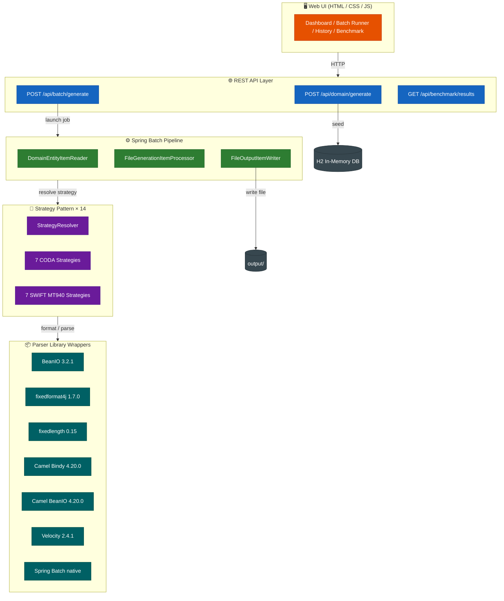

<p align="center">
  
  &nbsp;&nbsp;
  
</p>

# Banking Fixed-Length File Generator & Parser Platform

[](https://github.com/wallaceespindola/fixed-length-converters/actions/workflows/build.yml)
[](https://github.com/wallaceespindola/fixed-length-converters/actions/workflows/test.yml)
[](https://github.com/wallaceespindola/fixed-length-converters/actions/workflows/codeql.yml)
[](https://adoptium.net/)
[](https://spring.io/projects/spring-boot)
[](LICENSE)
[](https://www.febelfin.be/en/payments-standards/coda)
[](https://www.swift.com/standards/data-standards/mt)

Enterprise-grade banking file experimentation and benchmarking platform. Generates, parses, and benchmarks **CODA** and
**SWIFT MT940** fixed-length banking files using **7 Java formatter libraries**, all orchestrated through **Spring Batch
** and the **Strategy Pattern**.

---

## Overview

This platform is a technical laboratory for evaluating Java fixed-length parser frameworks across correctness,
performance, and Spring Batch compatibility. Engineers can:

- Generate realistic banking transaction datasets (configurable LOW or HIGH load profiles)
- Trigger Spring Batch jobs to produce CODA or SWIFT MT files via any of 7 libraries
- Compare library outputs side-by-side through benchmark dashboards
- Export benchmark results as CSV, JSON, Markdown, or styled HTML

---

## Architecture



### Batch Pipeline

```
ItemReader (H2) → ItemProcessor (StrategyResolver) → ItemWriter (output/)
```

Each Spring Batch job is parameterised by `fileType` (CODA/SWIFT) and `library` (
BEANIO/FIXEDFORMAT4J/FIXEDLENGTH/BINDY/CAMELBEANIO/VELOCITY/SPRINGBATCH). Jobs are **restartable** from the last
checkpoint.

### Strategy Pattern

14 strategy implementations — one per `FileType × Library` combination — all behind a single `FileGenerationStrategy`
interface:

| Class                        | Format      | Library             |
|------------------------------|-------------|---------------------|
| `CodaBeanIOStrategy`         | CODA        | BeanIO              |
| `CodaFixedFormat4JStrategy`  | CODA        | fixedformat4j       |
| `CodaFixedLengthStrategy`    | CODA        | fixedlength         |
| `CodaBindyStrategy`          | CODA        | Apache Camel Bindy  |
| `CodaCamelBeanIOStrategy`    | CODA        | Apache Camel BeanIO |
| `CodaVelocityStrategy`       | CODA        | Apache Velocity     |
| `CodaSpringBatchStrategy`    | CODA        | Spring Batch Native |
| `SwiftBeanIOStrategy`        | SWIFT MT940 | BeanIO              |
| `SwiftFixedFormat4JStrategy` | SWIFT MT940 | fixedformat4j       |
| `SwiftFixedLengthStrategy`   | SWIFT MT940 | fixedlength         |
| `SwiftBindyStrategy`         | SWIFT MT940 | Apache Camel Bindy  |
| `SwiftCamelBeanIOStrategy`   | SWIFT MT940 | Apache Camel BeanIO |
| `SwiftVelocityStrategy`      | SWIFT MT940 | Apache Velocity     |
| `SwiftSpringBatchStrategy`   | SWIFT MT940 | Spring Batch Native |

`StrategyResolver` selects the correct implementation at runtime via Spring's dependency injection — no `if`/`switch`
chains.

---

## Supported Banking Standards

### CODA — Belgian/European Bank Statement Format

**CODA** (COded DAily statement) is the official electronic bank statement format defined and maintained by
[Febelfin](https://www.febelfin.be/en/payments-standards/coda) — the Federation of Belgian Financial Sector
Institutions. It is the dominant machine-readable statement format used by Belgian corporate banking.

**Technical format:** fixed-width ASCII records of exactly **128 characters** per line, with structured record types:

| Record type | Meaning            |
|-------------|--------------------|
| `0`         | File header        |
| `1`         | Movement (debit/credit transaction) |
| `2`         | Movement detail / free communication |
| `8`         | Information record (closing balance) |
| `9`         | File trailer       |

**Adopted by all major Belgian banks**, delivered as a daily end-of-day statement file:

| Bank              | Country | Notes                                          |
|-------------------|---------|------------------------------------------------|
| BNP Paribas Fortis | Belgium | Largest Belgian bank by assets                |
| KBC Bank          | Belgium | Dominant retail and corporate bank             |
| ING Belgium       | Belgium | Part of ING Group (Netherlands)                |
| Belfius Bank      | Belgium | Formerly Dexia Bank Belgium                    |
| Argenta           | Belgium | Major savings and mortgage bank                |
| Crelan            | Belgium | Agricultural cooperative bank                  |
| bpost bank        | Belgium | Postal bank, wide retail coverage              |
| Triodos Bank      | Belgium | European ethical bank, BE/NL/DE/FR/ES branches |

CODA files are exchanged through **Isabel** (Isabel Group / Isabel 6 platform), the Belgian interbank file exchange
network that connects over 70 000 Belgian companies to their banks.

**Regulatory context:** Febelfin publishes versioned CODA specifications. Version 2.6 (current) aligns with the
**SEPA** payment area requirements and the **PSD2** open banking directive, ensuring CODA files carry the
structured IBAN/BIC identifiers required for cross-border euro payments.

---

### SWIFT MT940 — International Account Statement Messaging

**SWIFT MT940** is part of the SWIFT **MT (Message Type)** family, the legacy messaging standard operated by
[SWIFT](https://www.swift.com) (Society for Worldwide Interbank Financial Telecommunication) — the global
cooperative that connects over **11 500 financial institutions** across **200+ countries**.

MT940 carries the **Customer Statement Message**: a structured end-of-day account statement sent from a bank to a
corporate treasury system or ERP.

**Related MT messages in the statement family:**

| Message | Purpose                            | Typical delivery |
|---------|------------------------------------|------------------|
| MT940   | End-of-day customer statement      | Daily, T+0       |
| MT942   | Intraday statement (interim)       | Multiple per day |
| MT950   | Statement message (bank-to-bank)   | Daily            |
| MT941   | Balance report                     | On demand        |

**MT940 tag structure** (as implemented in this platform):

| Tag    | Field                  | Example                     |
|--------|------------------------|-----------------------------|
| `:20:` | Transaction reference  | `STMT20240115001`           |
| `:25:` | Account identification | `BE68539007547034EUR`       |
| `:28C:` | Statement / sequence  | `00001/001`                 |
| `:60F:` | Opening balance       | `C240114EUR10000,00`        |
| `:61:` | Statement line         | `2401150115CD500,00NTRFREF` |
| `:86:` | Information to owner   | Free-text transaction detail|
| `:62F:` | Closing balance       | `C240115EUR10500,00`        |

**Widely adopted by European banks** for corporate cash management and treasury integrations:

| Bank               | Country      | Notes                                                    |
|--------------------|--------------|----------------------------------------------------------|
| Deutsche Bank      | Germany      | Global transaction banking leader, MT940 since 1990s     |
| Commerzbank        | Germany      | Major German corporate bank                              |
| DZ Bank            | Germany      | Central bank for Volksbanken/Raiffeisenbanken network    |
| Société Générale   | France       | MT940 used across French and international corp clients  |
| BNP Paribas        | France       | Pan-European corporate treasury standard                 |
| Crédit Agricole    | France       | French agricultural banking network                      |
| ING Group          | Netherlands  | Retail + corporate across NL, BE, DE, PL, RO             |
| ABN AMRO           | Netherlands  | Dutch corporate banking, SWIFT service bureau            |
| Rabobank           | Netherlands  | Cooperative bank, NL/BE/DE agri-sector                   |
| UniCredit          | Italy        | Largest Italian bank, pan-European presence              |
| Intesa Sanpaolo    | Italy        | Second largest Italian bank                              |
| Santander          | Spain        | Largest Spanish bank, operates across EU                 |
| BBVA               | Spain        | Second largest Spanish bank                              |
| Erste Group        | Austria      | Central/Eastern Europe retail and corporate              |
| Raiffeisen Bank    | Austria      | CEE specialist, 13 European markets                      |
| PKO Bank Polski    | Poland       | Largest Polish bank by assets                            |
| mBank              | Poland       | Digital bank, major corporate MT940 user                 |
| Nordea             | Nordics      | MT940 for Nordic + Baltic corporate treasury             |
| SEB                | Sweden       | Nordic-Baltic corporate banking                          |
| Handelsbanken      | Sweden       | Nordic retail and corporate, conservative SWIFT adopter  |
| DNB                | Norway       | Largest Norwegian bank                                   |
| Danske Bank        | Denmark      | Pan-Nordic corporate banking                             |

**ISO 20022 migration:** SWIFT announced the industry-wide migration from legacy MT messages to **ISO 20022 XML (MX)**
messages. The coexistence period runs until **November 2025** (extended for some corridors into 2026), after which MT940
will be retired in favour of **camt.053** (Bank-to-Customer Statement). This platform's MT940 implementation serves
as a reference for teams validating parsers before migration.

| Legacy MT | ISO 20022 MX replacement | Direction                   |
|-----------|--------------------------|-----------------------------|
| MT940     | camt.053                 | Bank → Corporate            |
| MT942     | camt.052                 | Bank → Corporate (intraday) |
| MT950     | camt.053                 | Bank → Bank                 |
| MT101     | pain.001                 | Corporate → Bank            |

---

### Standards Summary

| Standard        | Authority | Coverage               | Format              | Delivery    |
|-----------------|-----------|------------------------|---------------------|-------------|
| **CODA**        | Febelfin  | Belgium (primary), SEPA | 128-char fixed-width | Daily EOD |
| **SWIFT MT940** | SWIFT     | 200+ countries, pan-EU | Tag-based free-text | Daily EOD   |

---

## Formatter Library Comparison

| Library                 | Version | Grammar Support | Annotation Quality | Spring Batch Fit | Risk   |
|-------------------------|---------|-----------------|--------------------|------------------|--------|
| **BeanIO**              | 3.2.1   | Excellent       | Good               | Good             | Low    |
| **fixedformat4j**       | 1.7.0   | Limited         | Excellent          | Excellent        | Low    |
| **fixedlength**         | 0.15    | Limited         | Good               | Good             | Medium |
| **Apache Camel Bindy**  | 4.20.0  | Limited         | Good               | Medium           | Medium |
| **Apache Camel BeanIO** | 4.20.0  | Excellent       | XML-based          | Medium           | Medium |
| **Apache Velocity**     | 2.4.1   | N/A (template)  | N/A                | Low (gen-only)   | Low    |
| **Spring Batch Native** | 5.x     | Excellent       | Programmatic       | Native           | Low    |

### Strategic Recommendations

| Scenario                          | Recommended Library |
|-----------------------------------|---------------------|
| Maximum CODA grammar correctness  | BeanIO              |
| Simplicity and modern annotations | fixedformat4j       |
| Existing Apache Camel ecosystem   | Apache Camel Bindy  |
| Lightweight experimentation       | fixedlength         |

---

## Some screenshots

### Benchmark


### History


---

## Quick Start

### Prerequisites

- Java 21+ (tested with Amazon Corretto 21)
- Maven 3.9+
- Python 3.12+ _(optional — benchmark aggregation tools only)_
- `make` _(optional — simplifies commands; see install instructions below)_

#### Installing `make`

| Platform            | Command                                                                                                                                                                                                          |
|---------------------|------------------------------------------------------------------------------------------------------------------------------------------------------------------------------------------------------------------|
| **macOS**           | `brew install make` _(already available via Xcode Command Line Tools: `xcode-select --install`)_                                                                                                                 |
| **Ubuntu / Debian** | `sudo apt-get install -y make`                                                                                                                                                                                   |
| **Fedora / RHEL**   | `sudo dnf install -y make`                                                                                                                                                                                       |
| **Windows**         | Install [Git for Windows](https://gitforwindows.org/) (includes `make` in Git Bash), or via [Chocolatey](https://chocolatey.org/): `choco install make`, or via [Scoop](https://scoop.sh/): `scoop install make` |

Verify with: `make --version`

### Build and Run

Each command is shown with `# with make` and `# direct` alternatives.

```bash
# Full pipeline — Java compile + 118 tests + JaCoCo coverage + install
mvn clean install

# Compile and package (skip tests)
# with make
make build
# direct
mvn clean install -DskipTests

# Start in dev mode — Swagger UI enabled at http://localhost:8080/swagger-ui.html
# with make
make run
# direct
mvn spring-boot:run -Dspring-boot.run.profiles=dev

# Start without dev profile (no Swagger)
# with make
make run-prod
# direct
mvn spring-boot:run

# Run all tests (unit + integration) with JaCoCo coverage
# with make
make test
# direct
mvn verify

# Run unit tests only
# with make
make test-unit
# direct
mvn test

# Run JMH benchmark suite
# with make
make benchmark
# direct
mvn test -Pbenchmark

# Remove build artifacts and generated output files
# with make
make clean
# direct
mvn clean

# Kill any running Spring Boot processes (free port 8080) — make only
make kill

# Run static analysis (compiler warnings) — make only
make lint

# Generate JaCoCo HTML coverage report → target/site/jacoco/index.html — make only
make docs

# List all available make targets with descriptions — make only
make help
```

Application starts at **http://localhost:8080**  
Swagger UI (dev profile only): **http://localhost:8080/swagger-ui.html**

### Python Benchmark Tools _(optional)_

After running benchmarks (`make benchmark` or `mvn test -Pbenchmark`), use the tools in `tools/python/` to analyse
results:

```bash
# Aggregate JMH results and print statistics table (mean, stdev, min per benchmark)
python tools/python/benchmark_aggregator.py
# or with explicit path:
python tools/python/benchmark_aggregator.py target/jmh-result.json

# Generate a Markdown + HTML report from JMH results
python tools/python/report_generator.py
# or with explicit paths:
python tools/python/report_generator.py target/jmh-result.json docs/benchmark-results.md
```

---

## REST API

| Method | Endpoint                         | Description                                                   |
|--------|----------------------------------|---------------------------------------------------------------|
| `POST` | `/api/domain/generate`           | Generate domain data in H2; optional `?loadProfile=LOW\|HIGH` |
| `POST` | `/api/batch/generate`            | Trigger Spring Batch job `{fileType, library}`                |
| `GET`  | `/api/batch/history`             | Last 50 batch job executions                                  |
| `GET`  | `/api/benchmark/results`         | All benchmark metrics                                         |
| `GET`  | `/api/benchmark/export/csv`      | Export as CSV                                                 |
| `GET`  | `/api/benchmark/export/markdown` | Export as Markdown                                            |
| `GET`  | `/api/benchmark/export/json`     | Export as JSON                                                |
| `GET`  | `/api/benchmark/export/html`     | Export as styled HTML (Velocity template)                     |
| `GET`  | `/actuator/health`               | Application health                                            |
| `GET`  | `/actuator/info`                 | Application metadata                                          |

### Load Profiles

`POST /api/domain/generate` accepts an optional `loadProfile` query parameter:

| Profile | Accounts | Transactions | Statements | Notes       |
|---------|----------|--------------|------------|-------------|
| `LOW`   | 20       | 200          | 10         | Default     |
| `HIGH`  | 200      | 2 000        | 100        | Stress test |

```bash
# Default (LOW) profile
curl -s -X POST http://localhost:8080/api/domain/generate | jq .

# HIGH load profile
curl -s -X POST 'http://localhost:8080/api/domain/generate?loadProfile=HIGH' | jq .
```

### Example: Generate Data and Run Batch

```bash
# Step 1: Generate domain data
curl -s -X POST http://localhost:8080/api/domain/generate | jq .

# Step 2: Generate CODA file using BeanIO
curl -s -X POST http://localhost:8080/api/batch/generate \
  -H "Content-Type: application/json" \
  -d '{"fileType":"CODA","library":"BEANIO"}' | jq .

# Step 3: View batch history
curl -s http://localhost:8080/api/batch/history | jq .

# Step 4: Export benchmark results
curl -s http://localhost:8080/api/benchmark/export/csv -o benchmark.csv
```

---

## Swagger UI

Swagger UI is available **only in the `dev` profile**:

```
http://localhost:8080/swagger-ui.html
http://localhost:8080/v3/api-docs
```

```bash
# with make
make run
# direct
mvn spring-boot:run -Dspring-boot.run.profiles=dev
```

---

## Spring Actuator

```bash
# Health check (public)
curl http://localhost:8080/actuator/health

# Application info (public)
curl http://localhost:8080/actuator/info
```

---

## Testing Strategy

| Category            | Test Class                                    | Tools              |
|---------------------|-----------------------------------------------|--------------------|
| Unit                | `DomainDataGeneratorTest`, `CodaRecordTest`   | JUnit 5 + Mockito  |
| Strategy resolution | `StrategyResolverTest`                        | `@SpringBootTest`  |
| CODA correctness    | `CodaStrategyTest`                            | `@SpringBootTest`  |
| SWIFT correctness   | `SwiftStrategyTest`                           | `@SpringBootTest`  |
| Round-trip symmetry | `SymmetryTest`                                | `@SpringBootTest`  |
| REST API            | `DomainControllerTest`, `BatchControllerTest` | MockMvc            |
| Actuator            | `ActuatorTest`                                | `TestRestTemplate` |
| Swagger             | `SwaggerAvailabilityTest`                     | `TestRestTemplate` |

```bash
# All tests (unit + integration) with JaCoCo coverage
# with make
make test
# direct
mvn verify

# Run a specific test class
mvn test -Dtest=StrategyResolverTest

# Run symmetry tests only
mvn test -Dtest=SymmetryTest

# Run API tests only
mvn test -Dtest="DomainControllerTest,BatchControllerTest"
```

---

## Frontend

The vanilla HTML/CSS/JS single-page UI (served directly by Spring Boot from `src/main/resources/static/`) provides:

- **Dashboard** — health status, actuator info, quick-action buttons
- **Data Generator** — trigger domain data generation with "Low Load" or "High Load" buttons, display results
- **Batch Runner** — select FileType + Library, submit, preview generated file. A "Run All Combinations" button fires
  all 14 fileType × library combinations sequentially with live per-row progress.
- **Batch History** — table of all job executions with auto-refresh every 15 s
- **Benchmark Dashboard** — bar charts and line charts via Chart.js, throughput comparison, library summary,
  CSV/JSON/Markdown export. Charts auto-sort by avg throughput (best to worst) on every refresh.

No build step is needed. To modify the UI, edit `src/main/resources/static/index.html` directly — `mvn spring-boot:run`
serves the latest version immediately. No Node.js or npm required.

---

## Repository Structure

```
fixed-length-converters/
├── pom.xml                     Maven build
├── Makefile                    Developer commands
├── src/main/java/com/wtechitsolutions/
│   ├── api/                    REST controllers + DTO records
│   ├── batch/                  Spring Batch reader/processor/writer/listeners
│   ├── benchmark/              BenchmarkService (CSV/JSON/MD/HTML export)
│   ├── config/                 Spring, Batch, OpenAPI, Web config
│   ├── domain/                 JPA entities + repositories + DomainDataGenerator + LoadProfile enum
│   ├── parser/                 7 formatter wrappers + annotated model classes
│   └── strategy/               FileGenerationStrategy + 14 implementations
├── src/main/frontend/          React source (kept for reference; UI now served from static/)
├── src/main/resources/static/  Vanilla HTML/CSS/JS UI (index.html — served directly)
├── docs/
│   ├── examples/coda/          Valid, malformed, edge-case CODA files
│   ├── examples/swift-mt/      Valid, malformed, edge-case SWIFT MT940 files
│   └── diagrams/               Architecture diagrams (.puml + .mmd)
├── tools/python/               Benchmark aggregation + report generation
├── output/                     Generated banking files (gitignored)
└── .github/workflows/          build, test, benchmark, codeql, release
```

---

## Links

### Banking Standards — Official References

- [Febelfin CODA Specification](https://www.febelfin.be/en/payments-standards/coda) — official versioned CODA spec (Febelfin)
- [SWIFT MT940 — Customer Statement Message](https://www.swift.com/standards/data-standards/mt) — official SWIFT MT standards page
- [SWIFT Standards — MT Message Reference](https://www2.swift.com/knowledgecentre/publications/us9m_20230720/2.0?topic=mt940.htm) — MT940 field-level reference
- [SWIFT ISO 20022 Migration Programme](https://www.swift.com/standards/iso-20022) — coexistence timeline and MX migration guide
- [camt.053 — Bank-to-Customer Statement (ISO 20022)](https://www.iso20022.org/catalogue-messages/iso-20022-messages-archive?search=camt.053) — MT940 successor format
- [European Payments Council — SEPA Standards](https://www.europeanpaymentscouncil.eu/what-we-do/enabling-technology/standards) — SEPA payment scheme technical specs
- [Isabel Group — Belgian Interbank File Exchange](https://www.isabel.eu/) — platform distributing CODA files to Belgian corporates
- [ECB Payment Statistics](https://www.ecb.europa.eu/stats/payment_and_exchange_rates/payment_statistics/html/index.en.html) — European Central Bank payment infrastructure data

### Parser Libraries

- [BeanIO on Maven Central](https://mvnrepository.com/artifact/com.github.beanio/beanio)
- [fixedformat4j on Maven Central](https://mvnrepository.com/artifact/com.ancientprogramming.fixedformat4j/fixedformat4j)
- [fixedlength on Maven Central](https://mvnrepository.com/artifact/name.velikodniy.vitaliy/fixedlength)
- [Apache Camel Bindy](https://camel.apache.org/components/latest/dataformats/bindy-dataformat.html)
- [Apache Camel BeanIO](https://camel.apache.org/components/latest/dataformats/beanio-dataformat.html)
- [Apache Velocity](https://velocity.apache.org/)
- [Spring Batch — FlatFileItemReader](https://docs.spring.io/spring-batch/reference/readers-and-writers/flat-files.html)

---

## Author

**Wallace Espindola**

- Email: [wallace.espindola@gmail.com](mailto:wallace.espindola@gmail.com)
- LinkedIn: [linkedin.com/in/wallaceespindola](https://www.linkedin.com/in/wallaceespindola/)
- GitHub: [github.com/wallaceespindola](https://github.com/wallaceespindola/)
